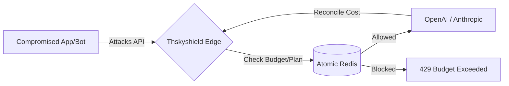

# 🛡️ Thskyshield — The Final Layer of AI Governance

**Stopping "Denial of Wallet" (DWL) at the Atomic Level.**

[](https://www.npmjs.com/package/@thsky-21/thskyshield)
[](https://opensource.org/licenses/MIT)

---

## 🚨 The Reality of 2026: Everything is Compromised

In March 2026, the **TeamPCP supply chain attacks** proved that traditional perimeter security is dead. By poisoning **LiteLLM** (v1.82.7/8) and **Axios** (v1.14.1), attackers exfiltrated thousands of OpenAI/Anthropic API keys directly from environment variables and CI/CD pipelines.

**The Problem:** Most AI startups have *zero* per-user spend controls. Once a key is leaked, an attacker can spin up infinite recursive agent loops, leading to a total **Denial of Wallet (DWL)** attack.

* **OWASP LLM10:2025 (Unbounded Consumption):** Formally recognizes resource exhaustion and uncontrolled cost growth as a top critical risk for LLM applications.
* **McKinsey Global Tech Agenda (2026):** 72% of CIOs identify cybersecurity as the #1 barrier to scaling Agentic AI.
* **The "Invisible" Loss:** Industry data shows 41% of LLM-native companies exceed their monthly budgets by over 200% due to unmanaged agentic loops and token abuse.

---

## 🛠️ Thskyshield: The Last Layer of Defense

Thskyshield is a B2B AI Governance SaaS designed to sit between your application and your LLM provider. Even if your **API keys are compromised**, Thskyshield enforces your governance policies at the edge before a single cent is spent.

### Why We Are Different (The Tech Moat)
Most "AI Firewalls" are too slow or rely on simple rate-limiting. Thskyshield uses an **Atomic Lua Governance Engine**.

1.  **Atomic Reservations:** We use custom Lua scripts inside **Upstash Redis** to perform a "Check-and-Reserve" operation in a single millisecond-fast round trip. This eliminates race conditions where multiple parallel requests might exceed a budget before the first one is logged.
2.  **24h Spend Persistence:** Our engine writes to spend keys immediately with a 24-hour TTL, ensuring that even if an Edge instance dies mid-request, the budget enforcement remains consistent.
3.  **Plan-Aware Governance:** Automatically toggle between `free`, `pro`, and `enterprise` daily budgets in real-time. A $5.00 limit for a free user is enforced even if your master OpenAI key has a $50,000 limit.

---

## 🏗️ Architecture

Thskyshield acts as a secure proxy/governance layer for your compute:



---

## 🧩 Two Products, One Atomic Engine

Thskyshield ships as two governance products that share the same integer-microdollar, Lua-on-Redis core.

| | **Thskyshield for Agents** | **Thskyshield for LLM Apps** |
|---|---|---|
| **Protects against** | Runaway autonomous loops, infinite recursion, stuck tool chains | Per-user Denial-of-Wallet, token abuse, budget overrun |
| **Enforces** | Per-**run** cost ceiling, iteration limit, loop detection, timeout | Per-**user** daily spend limit, plan-aware budgets |
| **Mechanism** | Hard kill switch (`ShieldKilledError`) before the next step fires | Two-phase atomic check / log before the call fires |
| **API surface** | `shield.beginRun()` → `Run` (`beforeStep` / `afterStep` / `end`) | `shield.check()` / `shield.log()` |
| **HTTP routes** | `/v1/run/*` | `/api/v1/check` · `/api/v1/log` |

Both run on **sub-10ms** edge enforcement and fail **open** — a control-plane outage never blocks your traffic.

---

## ⚡ Quickstart

```bash
npm install @thsky-21/thskyshield
```

```ts
import { Thskyshield } from '@thsky-21/thskyshield'

const shield = new Thskyshield({
  siteId: process.env.THSKYSHIELD_SITE_ID!,
  apiKey: process.env.THSKYSHIELD_KEY!,
})
```

> Grab a `siteId` and API key from your dashboard. The key is shown **once** at creation — only a SHA-256 hash is ever stored server-side.

---

### 🤖 Product 1 — Governing Autonomous Agents

Wrap any agent loop (LangGraph, CrewAI, the OpenAI Agents SDK, or your own `while` loop). The shield enforces a hard budget ceiling, iteration cap, loop detector, and timeout. When any limit trips, `beforeStep()` throws `ShieldKilledError` **before** the next LLM/tool call executes.

```ts
import { Thskyshield, ShieldKilledError } from '@thsky-21/thskyshield'

const shield = new Thskyshield({ siteId, apiKey })

const run = await shield.beginRun({
  budgetLimitUsd: 2.00,   // hard ceiling — kills the run when spent + reserved would exceed it
  iterationLimit: 30,     // max steps
  loopThreshold:  5,      // identical prompt N times → killed_loop
  timeoutSeconds: 300,    // wall-clock cap
})

try {
  while (!done) {
    // 1. Reserve budget for the NEXT step (atomic). Throws if the run is killed.
    const { requestId, remainingUsd } = await run.beforeStep({
      stepType:        'llm',
      model:           'gpt-4o-mini',
      estimatedTokens: { input: 500, output: 200 },
      promptInput:     currentPrompt,   // fingerprinted for loop detection
    })

    const result = await callYourLLM(currentPrompt)

    // 2. Settle the reservation with the real token usage.
    await run.afterStep({
      requestId,
      actualTokens: result.usage,
      model:        'gpt-4o-mini',
    })
  }
} catch (e) {
  if (e instanceof ShieldKilledError) {
    // e.reason: 'killed_budget' | 'killed_loop' | 'killed_iterations' | 'killed_timeout'
    console.log(`Agent stopped: ${e.reason}. Spent: $${e.spent}`)
  }
} finally {
  const summary = await run.end()
  console.log(`Total: $${summary.totalCostUsd}`)
}
```

Prefer auto-cleanup? Use the wrapper:

```ts
const { summary } = await shield.withRun({ budgetLimitUsd: 2 }, async (run) => {
  // your agent loop — run.end() is called for you in finally
})
```

#### Kill triggers

| Status | Fires when | 
|---|---|
| `killed_budget` | `spent + reserved + nextCost > budgetLimitUsd` |
| `killed_loop` | the same prompt fingerprint repeats ≥ `loopThreshold` |
| `killed_iterations` | step counter reaches `iterationLimit` |
| `killed_timeout` | wall-clock elapsed exceeds `timeoutSeconds` |

The check order inside the single Lua round-trip is: **status → timeout → iterations → loop → budget → allow**.

---

### 💸 Product 2 — Per-User Spend Enforcement for LLM Apps

A two-phase flow: `check()` atomically reserves budget **before** the call; `log()` reconciles the real cost after. A `requestId` ties the two together and carries the plan automatically.

```ts
// PHASE A — before the OpenAI call fires
const { allowed, reason, requestId } = await shield.check({
  externalUserId: user.id,
  model:          'gpt-4o',
  plan:           user.tier,   // "free" | "pro" | "enterprise" → plan-aware budget
})

if (!allowed) {
  return res.status(429).json({ error: reason }) // e.g. budget_exceeded
}

const completion = await openai.chat.completions.create({ /* ... */ })

// PHASE B — reconcile real usage (carries plan via requestId)
await shield.log({
  requestId,
  externalUserId: user.id,
  model:          'gpt-4o',
  tokens: {
    input:  completion.usage.prompt_tokens,
    output: completion.usage.completion_tokens,
  },
})
```

**Budget resolution order:** Redis cache → `site_plans` (per-plan limit) → `sites.budget_limit` (flat) → `$1.00` default.

---

## 🔬 How the Atomic Engine Works

**Money is integer microdollars everywhere.** 1 MD = `0.000001` USD, so `$1 = 1,000,000 MD`. All Redis counters and Lua math stay integer — no `INCRBYFLOAT` drift — and convert to USD only at the API response boundary.

**Single round-trip enforcement.** Every `beforeStep` runs one Lua script that, atomically:

1. reads the run status, timeout, iteration counter, prompt-fingerprint counter, settled spend, and in-flight reservation;
2. evaluates all four kill conditions in order;
3. on allow, reserves the estimated cost, bumps the iteration + fingerprint counters, and writes a short-lived **bridge key** (`requestId → reserved MD`, 5-min TTL).

`afterStep` then reads the bridge key, moves the reserved amount into settled `:spent`, decrements `:reserved`, and deletes the bridge — also in a single atomic script.

**Reserve-then-settle** is why concurrent steps can't race past the ceiling: the reservation is visible to every parallel request the instant it's written, long before the real cost is known.

**Fail-open by design.** If the control plane is unreachable, the SDK and the `before-step` route return `{ allowed: true }` (`SYSTEM_DEGRADED`). Governance failure never takes your agent or app down.

---

## 🌐 HTTP API (no SDK required)

Auth is a bearer token (`Authorization: Bearer <apiKey>`).

**Agent runs** — `/v1/run/*`

| Method | Route | Purpose |
|---|---|---|
| `POST` | `/v1/run/begin` | start a governed run, returns `run_id` |
| `POST` | `/v1/run/{runId}/before-step` | reserve + run kill checks |
| `POST` | `/v1/run/{runId}/after-step` | settle actual cost |
| `POST` | `/v1/run/{runId}/end` | finalize, returns summary |
| `GET`  | `/v1/run/{runId}` | current run state |

**LLM-app spend** — `/api/v1/*`

| Method | Route | Purpose |
|---|---|---|
| `POST` | `/api/v1/check` | Phase A — reserve + decide |
| `POST` | `/api/v1/log` | Phase B — reconcile usage |

---

## 🛠️ Tech Stack

- **Next.js 16** (App Router) + **TypeScript** — edge-deployed on **Vercel**
- **Upstash Redis** (HTTP, edge-compatible) — the atomic Lua governance engine
- **Supabase** (Postgres) — sites, API keys, plans, run/step audit history
- **Clerk** — dashboard auth
- **Resend** — transactional mail
- SDK published as **[`@thsky-21/thskyshield`](https://www.npmjs.com/package/@thsky-21/thskyshield)** (v3.0.0, MIT)

---

## 📦 SDK Reference

```ts
import { Thskyshield, Run, ShieldKilledError } from '@thsky-21/thskyshield'
// Note: lowercase 's' — Thskyshield. ThskyShield does not exist.

// ── LLM App (v2) ──
const shield = new Thskyshield({ siteId, apiKey, defaultPlan? })
const { allowed, reason, requestId } = await shield.check({ externalUserId, model, estimatedTokens?, plan? })
await shield.log({ requestId, externalUserId, model, tokens })

// ── Agent Run (v3) ──
const run = await shield.beginRun({ budgetLimitUsd, iterationLimit?, timeoutSeconds?, loopThreshold? })
const { requestId, remainingUsd } = await run.beforeStep({ stepType, model?, estimatedTokens?, promptInput? })
await run.afterStep({ requestId, actualTokens, model })
const summary = await run.end()

// ShieldKilledError → .reason  .runId  .spent  .remaining
```

Full migration notes are in [`packages/nextjs/CHANGELOG.md`](packages/nextjs/CHANGELOG.md). v3 is fully backward-compatible with v2 — the agent methods are purely additive.

---

## 📄 License

MIT © Thskyshield
